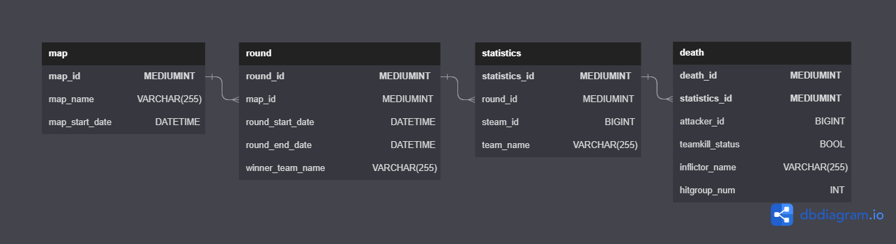

# TTT2 Stats

Record TTT2 player stats and save it to a MySQL Database.

# Installation

## MySQLOO

Download the latest [MySQLOO DLL](https://github.com/FredyH/MySQLOO/releases) for your system and put it in the `garrysmod/lua/bin` folder of your server (for a normal linux server installation probably the 32-Bit linux version).

## TTT2-Stats

Clone this repository to you servers `garrysmod/addons` folder.

# Configuration

- Start your server with MySQLOO and TTT2-Stats installed.
- Go to `garrysmod/data/ttt2_stats` and open `config.txt`.
- Add the URL to your website where you want to display the stats under `website`.
- Fill out all the MySQL-Database information. `caCert` is optional and can be empty.
- Restart your server.

## Example configuration

```json
{
	"website": "https://stats.your-website.com/",
	"db": {
		"host": "your-mysql-db-host.com",
		"database": "your-db-name",
		"username": "your-db-username",
		"password": "your-db-password",
		"port": 3306.0,
		"caCert": "/etc/ssl/certs/ca-certificates.crt"
	}
}
```

# Usage

You can type `!stats` in chat or press `F4` to open your stats website.

# Database tables


